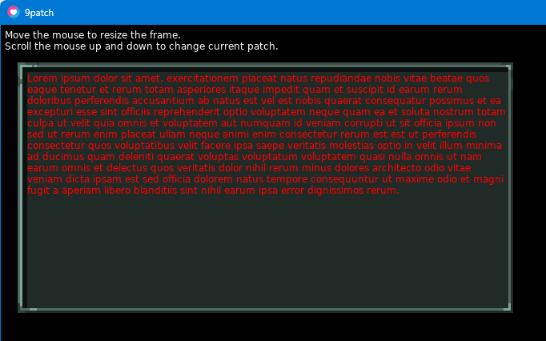
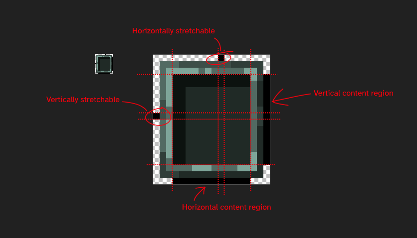

# p9
Yet another 9patch library for Love2D. Similar to [patchy](https://github.com/excessive/patchy)
and [slicy](https://github.com/wqferr/slicy), but it's a lot smaller, uses a GLSL shader for
rendering, wraps the texture instead of simply stretching it, and is permissively licensed.



## Usage
```lua
local p9 = require('p9')
local patch = p9.load('frame.9.png')

function love.draw()
	patch:draw(10, 10, 100, 100)

	local x, y, w, h = p:getContentWindow()
	love.graphics.setScissor(x, y, w, h)
	-- Do some drawing within the content region
	love.graphics.setScissor()
end
```

The `draw` method also returns the same values as `getContentWindow`.

## The format
The `.9.png` format is a regular image file, except the first/last rows/columns are intended as
metadata indicators.


